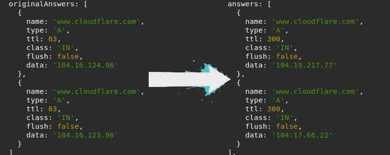
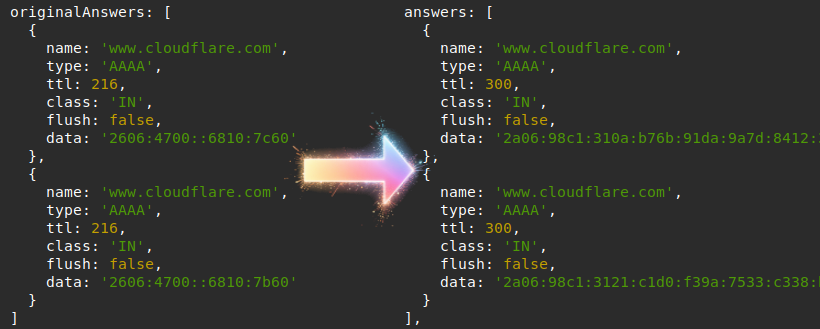

# 域名解析结果替换JS DNS-Response-Replacer-JS

这是一个可以把DNS查询结果中的 Cloudflare IP 替换为特定 IP 的域名解析服务。

------

## 原理

本工具本质上是一个 **域名伺服器（Name server）** 。用户需要在网络设置中配置DNS地址为本服务地址。

当进行DNS查询时，假如工具检测到上游返回的查询结果中包含 Cloudflare IP 地址时，将 DNS 查询结果替换为用户指定的 IP 地址。

### 代码逻辑

核心文件 `dns-response-replacer-js.js`，执行命令 `node dns-response-replacer-js.js` 后， **dns-response-replacer-js** 会监听本地53端口（需要操作系统权限），并开始域名解析服务。当用户发起DNS查询请求时， **dns-response-replacer-js** 会向 `dns-servers.list` 文件中的上游DNS服务器发起DNS查询，返回结果后，**dns-response-replacer-js** 会将 *A 类型* 和 *AAAA 类型* 的查询结果与 Cloudflare 的 IP 地址进行比较（`cloudflare-ipv4-list.list` 和 `cloudflare-ipv6-list.list`），当上游查询结果匹配 Cloudflare 的 IP 时，将查询结果替换为用户自行设定的IP（`cloudflare-ipv4-cfst-list.list` 和 `cloudflare-ipv6-cfst-list.list`），默认随机返回 **2** 个结果，并将查询结果缓存到 `cache/cache.json` 中，以备重复查询和服务下次启动使用。

------

## 使用

### 安装

本服务依赖 **Node**，建议使用 *Node v22 LTS* 或 *Node v24* 。

本项目为 Node 项目，理论上可以运行在 Windows、Linux、Openwrt 上。

（TBD）

### 首次使用配置

（本工具不包含[CloudflareSpeedTest](https://github.com/XIU2/CloudflareSpeedTest)，请自行下载安装运行）

- 首次使用请手动使用 [CloudflareSpeedTest](https://github.com/XIU2/CloudflareSpeedTest) 进行 IP 优选。请将 IPv4 与 IPv6 分开进行测试。然后将满意的测试结果复制到 `cloudflare-ipv4-cfst-list.list` 和 `cloudflare-ipv6-cfst-list.list` 中（仅复制IP，每行一个）。
- 将本地使用的 DNS nameserver 地址填写到 `dns-servers.list` 文件中。每行一条。建议添加符合你网络的DNS服务器地址（宽带光猫/路由器，所属宽带运营商下发的DNS，云公共DNS）。建议添加2-5个。

### 启动服务

- 执行 `node dns-response-replacer-js.js`
- 将本机的 DNS 服务器地址填写为运行本工具的地址，如为本机则是 `127.0.0.1`

注意只能填写运行本服务的主机地址，不能在备用DNS地址填写其他DNS服务地址，否则其他DNS返回的地址可能会被系统优先采用。

### 更新自选 IP

- 将新的IP列表复制到 `cloudflare-ipv4-cfst-list.list` 和 `cloudflare-ipv6-cfst-list.list` 中
- 然后停止本服务
- **删除 `cache/cache.json`文件**
- 重新启动本服务

------
## 声明

- 本项目基本由 Node 和 Javascript 编写，性能有限。
- 本服务仅供学习使用，建议仅供个人使用。请勿用于多人网络或大规模生产环境。
- 因用户自行使用造成的断网或其他后果，由用户自行承担，本项目不负任何责任。
- 本项目大量使用 AI 进行辅助编写。

------

## To-Do

（TBD）

------

## LICENSE

This project is licensed under **GNU AFFERO GENERAL PUBLIC LICENSE Version 3**#
